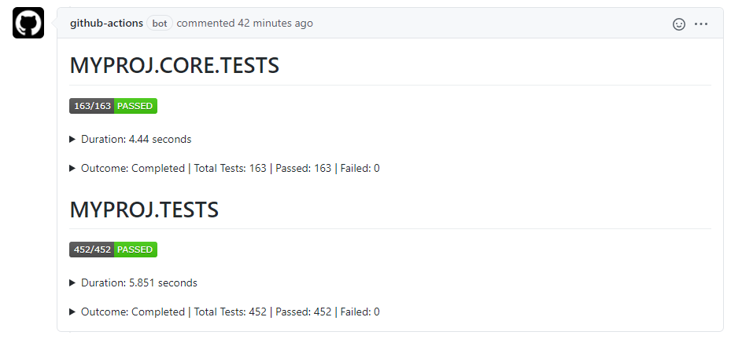
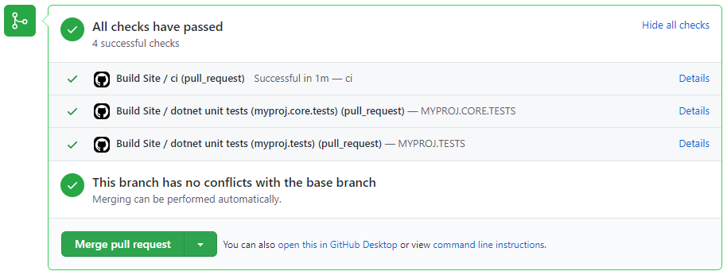
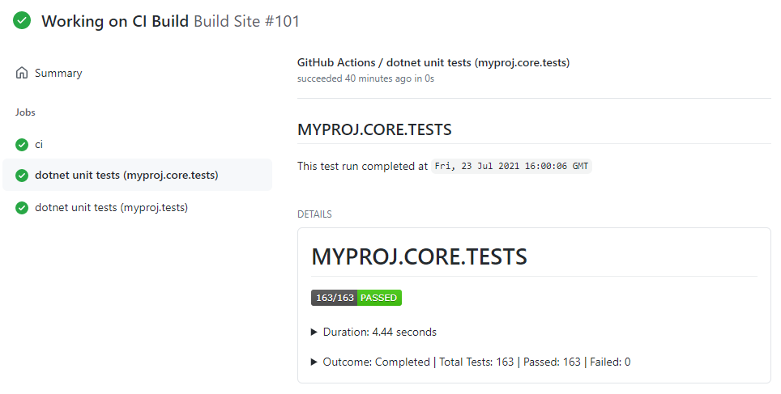
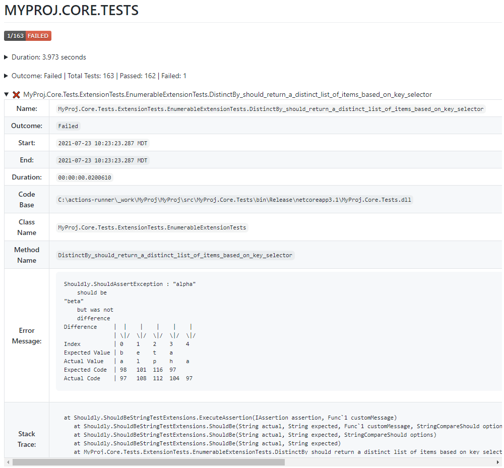

# process-dotnet-test-results

This repository is based on [NasAmin/trx-parser]

This action works in conjunction with a previous step that runs `dotnet test --logger trx` and has created `trx` files for this action to process. This action will examine the parsed results and create a Status Check or PR Comment depending on the flags set. This action does not run the tests itself.

If creating status checks is enabled, one status check will be created for each `trx` file found.  If creating pr comments is enabled, one comment will be created for all `trx` files.  The status check title and each comment heading are named after the test project the `trx` was generated for.

## Index <!-- omit in toc -->

- [process-dotnet-test-results](#process-dotnet-test-results)
  - [Failures](#failures)
  - [Limitations](#limitations)
  - [Action Outputs](#action-outputs)
    - [Pull Request Comment](#pull-request-comment)
    - [Pull Request Status Check](#pull-request-status-check)
    - [Workflow Run](#workflow-run)
    - [Failed Test Details](#failed-test-details)
  - [Inputs](#inputs)
  - [Outputs](#outputs)
  - [Usage Examples](#usage-examples)
    - [Using the defaults](#using-the-defaults)
    - [Specifying additional behavior](#specifying-additional-behavior)
    - [Using create-results-file](#using-create-results-file)
      - [Report Title](#report-title)
  - [Contributing](#contributing)
    - [Incrementing the Version](#incrementing-the-version)
    - [Source Code Changes](#source-code-changes)
    - [Recompiling Manually](#recompiling-manually)
    - [Updating the README.md](#updating-the-readmemd)
  - [Code of Conduct](#code-of-conduct)
  - [License](#license)

## Failures

The test status & action's conclusion can be viewed in multiple places:

- In the body of a PR comment this action generates
- Next to the name of one of the status checks under the `Checks` section of a PR
- Next to the name of one of the status checks under the `Jobs` section of the workflow run
- In the body of a status check listed on the workflow run

If the test results contain failures, the status check's conclusion will be set to `failure`. If the status check is required and its conclusion is `failure` the PR cannot be merged.  If this required status check behavior is not desired, the `ignore-test-failures` input can be set and the conclusion will be marked as `neutral` if test failures are detected. The status badge that is shown in the comment or status check body will still indicate it was a `failure` though.

## Limitations

GitHub does have a size limitation of 65535 characters for a Status Check body or a PR Comment. This action would fail if the test results exceeded the GitHub [limit]. To mitigate this size issue only details for failed tests are included in the output in addition to a badge, duration info and outcome info.  If the comment still exceeds that size, it will be truncated with a note to see the remaining output in the log.

If you have multiple workflows triggered by the same `pull_request` or `push` event, GitHub creates one checksuite for that commit. The checksuite gets assigned to one of the workflows randomly and all status checks for that commit are reported to that checksuite. That means if there are multiple workflows with the same trigger, your status checks for this action may show on a different workflow run than the run that executed this action.

## Action Outputs

### Pull Request Comment

This is shown on the pull request when the `create-pr-comment` is set to `true` and there is a PR associated with the commit.
<kbd></img></kbd>

### Pull Request Status Check

This is shown on the pull request when the `create-status-check` is set to `true` and there is a PR associated with the commit.
<kbd></img></kbd>

### Workflow Run

This is shown on the workflow run when the `create-status-check` is set to `true`.
<kbd></img></kbd>

### Failed Test Details

For failed test runs you can expand each failed test and view more details about the failure
<kbd></img></kbd>

## Inputs

| Parameter                      | Is Required | Default                          | Description                                                                                                                                                                         |
|--------------------------------|-------------|----------------------------------|-------------------------------------------------------------------------------------------------------------------------------------------------------------------------------------|
| `github-token`                 | true        | N/A                              | Used for the GitHub Checks API. Value is generally: secrets.GITHUB_TOKEN.                                                                                                           |
| `base-directory`               | false       | `.` Root Directory of repository | The base directory of where to look for `trx` files.                                                                                                                                |
| `create-status-check`          | false       | true                             | Flag indicating whether a status check with code coverage results should be generated.                                                                                              |
| `create-pr-comment`            | false       | true                             | Flag indicating whether a PR comment with dotnet test results should be generated. When `true` the default behavior is to update an existing comment if one exists.                 |
| `create-results-file`          | false       | false                            | Flag indicating whether a results file in markdown format should be generated.                                                                                                      |
| `update-comment-if-one-exists` | false       | true                             | When `create-pr-comment` is true, this flag determines whether a new comment is created or if the action updates an existing comment if one is found which is the default behavior. |
| `ignore-test-failures`         | false       | `false`                          | When set to true the check status is set to `Neutral` when there are test failures and it will not block pull requests.                                                             |
| `timezone`                     | false       | `UTC`                            | IANA time zone name (e.g. America/Denver) to display dates in.                                                                                                                      |
| `comment-identifier`           | false       | ``                               | Used when there are multiple test projects that run separately but are part of the same CI run.                                                                                     |
| `report-title-filter`          | false       |                                  | Enables truncating the report title by filtering out previous name parts taken from the trx UnitTest `name`.  See [Report Title](#report-title) below for more information.         |

## Outputs

| Output                   | Description                                                                                                                                                                                                                    |
|--------------------------|--------------------------------------------------------------------------------------------------------------------------------------------------------------------------------------------------------------------------------|
| `test-outcome`           | Test outcome based on presence of failing tests: _Failed,Passed_<br/>If exceptions are thrown or if it exits early because of argument errors, this is set to Failed.                                                          |
| `trx-files`              | List of `trx` files that were processed                                                                                                                                                                                        |
| `test-results-file-path` | File path for the file that contains the pre-truncated test results in markdown format.  This is the same output that is posted in the PR comment. This will be `null` when the input `create-results-file` is set to `false`. |
| `test-results-truncated` | Flag indicating whether test results were truncated due to markdown exceeding character limit of 65535.                                                                                                                        |
| `status-check-ids`       | A comma-separated string of IDs for any status checks that were created. This is only set if `create-status-check` is `true` and one or more status checks were created successfully.                                          |
| `pr-comment-id`          | The ID of the PR comment that was created.  This is only set if `create-pr-comment` is `true` and a PR was created successfully.                                                                                               |

## Usage Examples

### Using the defaults

```yml
permissions:
    contents: read
    pull_request: write # required if create-pr-comment: true
    checks: write       # required if create-status-check: true

jobs:
  ci:
    runs-on: [ubuntu-latest]
    steps:
      - uses: actions/checkout@v4

      - name: dotnet test with coverage
        run: dotnet test './src/MyProj.sln' --logger trx --configuration Release

      - name: Process trx reports with default
        if: always()
        # You may also reference just the major or major.minor version
        uses: im-open/process-dotnet-test-results@v2.4.0
        with:
          github-token: ${{ secrets.GITHUB_TOKEN }}
```

### Specifying additional behavior

```yml
permissions:
    contents: read
    pull_request: write # required if create-pr-comment: true
    checks: write       # required if create-status-check: true

jobs:
  advanced-ci:
    runs-on: [ubuntu-latest]
    steps:
      - uses: actions/checkout@v4

      - name: Test My Solution
        continue-on-error: true
        run: dotnet test ./src/my-solution.sln --logger "trx" --configuration Release --results-directory ../../test-results

      - name: Process trx reports
        id: process-trx
        # You may also reference just the major or major.minor version
        uses: im-open/process-dotnet-test-results@v2.4.0
        with:
          github-token: ${{ secrets.GITHUB_TOKEN }}
          base-directory: './test-results'
          create-status-check: true
          create-pr-comment: true
          update-comment-if-one-exists: true
          ignore-test-failures: true
          timezone: 'america/denver'
          comment-identifier: 'bff-tests'

      # Optional
      - name: Annotate Test Outcome
        if: steps.process-trx.outputs.test-results-truncated == 'true'
        run: cat ${{ steps.process-trx.outputs.test-results-file-path }} > $GITHUB_STEP_SUMMARY

      # Optional
      - name: Upload Outcome as artifact if character limit reached
        if: steps.process-trx.outputs.test-results-truncated == 'true'
        uses: actions/upload-artifact@v4
        with:
          name: Cypress-Results
          path: |
            ${{ steps.process-trx.outputs.test-results-file-path }}
          retention-days: 7

      - run: ./do-other-advanced-things-in-the-build.sh

      - name: Fail if there were test problems
        if: steps.process-trx.outputs.test-outcome == 'Failed'
        run: |
          echo "There were test failures."
          exit 1
```

### Using create-results-file

```yml
permissions:
    contents: read
    pull_request: write # required if create-pr-comment: true
    checks: write       # required if create-status-check: true

jobs:
  ci:
    runs-on: [ubuntu-latest]
    steps:
      - uses: actions/checkout@4

      - name: dotnet test with coverage
        run: dotnet test './src/MyProj.sln' --logger trx --configuration Release

      - name: Process trx reports with default
        if: always()
        id: process-test
        # You may also reference just the major or major.minor version
        uses: im-open/process-dotnet-test-results@v2.4.0
        with:
          github-token: ${{ secrets.GITHUB_TOKEN }}
          create-status-check: false
          create-pr-comment: false
          create-results-file: true
          report-title-filter: 'Tests' # See Report Title Notes below on title output

      - name: Annotate Test Results
        run: cat ${{ steps.process-test.outputs.test-results-file-path }} > $GITHUB_STEP_SUMMARY
```

#### Report Title

In the example the first test is named: `Widget.Tests.MathTests.OnePlusOneShouldNotEqualFive`.  If `report-title-filter: 'Tests'` is used, then the action will use the next name part (split by `.`) so the title of the report would be `MathTests`.

When `report-title-filter` is provided, the action uses the `name` of the first UnitTest in the `.trx` file.  That name is then split into parts by `.`.  The report title will be set to the value of the name part following the name part that matches the `report-title-filter`.  If that does not result in a value, the action will default to examining the `storage` property of the first UnitTest and setting the report title based on `.dll` name.

Example

- Test Name=`Widget.Tests.MathTests.OnePlusOneShouldNotEqualFive`
- Test dll=`widget.tests.dll`

  | report-title-filter | Report Title                 |
  |---------------------|------------------------------|
  | `Widget`            | Tests                        |
  | `Tests`             | MathTests                    |
  | `MathTests`         | OnePlusOneShouldNotEqualFive |
  | `Other`             | WIDGET.TESTS                 |
  | _empty_             | WIDGET.TESTS                 |

This input is helpful to differentiate groups of tests in the markdown that is output to a file and the pull request comment.  To get a list of Unit Test names run `dotnet test --list-tests` in the cli.

## Contributing

When creating PRs, please review the following guidelines:

- [ ] The action code does not contain sensitive information.
- [ ] At least one of the commit messages contains the appropriate `+semver:` keywords listed under [Incrementing the Version] for major and minor increments.
- [ ] The action has been recompiled.  See [Recompiling Manually] for details.
- [ ] The README.md has been updated with the latest version of the action.  See [Updating the README.md] for details.

### Incrementing the Version

This repo uses [git-version-lite] in its workflows to examine commit messages to determine whether to perform a major, minor or patch increment on merge if [source code] changes have been made.  The following table provides the fragment that should be included in a commit message to active different increment strategies.

| Increment Type | Commit Message Fragment                     |
|----------------|---------------------------------------------|
| major          | +semver:breaking                            |
| major          | +semver:major                               |
| minor          | +semver:feature                             |
| minor          | +semver:minor                               |
| patch          | _default increment type, no comment needed_ |

### Source Code Changes

The files and directories that are considered source code are listed in the `files-with-code` and `dirs-with-code` arguments in both the [build-and-review-pr] and [increment-version-on-merge] workflows.  

If a PR contains source code changes, the README.md should be updated with the latest action version and the action should be recompiled.  The [build-and-review-pr] workflow will ensure these steps are performed when they are required.  The workflow will provide instructions for completing these steps if the PR Author does not initially complete them.

If a PR consists solely of non-source code changes like changes to the `README.md` or workflows under `./.github/workflows`, version updates and recompiles do not need to be performed.

### Recompiling Manually

This command utilizes [esbuild] to bundle the action and its dependencies into a single file located in the `dist` folder.  If changes are made to the action's [source code], the action must be recompiled by running the following command:

```sh
# Installs dependencies and bundles the code
npm run build
```

### Updating the README.md

If changes are made to the action's [source code], the [usage examples] section of this file should be updated with the next version of the action.  Each instance of this action should be updated.  This helps users know what the latest tag is without having to navigate to the Tags page of the repository.  See [Incrementing the Version] for details on how to determine what the next version will be or consult the first workflow run for the PR which will also calculate the next version.

## Code of Conduct

This project has adopted the [im-open's Code of Conduct](https://github.com/im-open/.github/blob/main/CODE_OF_CONDUCT.md).

## License

Copyright &copy; 2024, Extend Health, LLC. Code released under the [MIT license](LICENSE).

<!-- Links -->
[Incrementing the Version]: #incrementing-the-version
[Recompiling Manually]: #recompiling-manually
[Updating the README.md]: #updating-the-readmemd
[source code]: #source-code-changes
[usage examples]: #usage-examples
[build-and-review-pr]: ./.github/workflows/build-and-review-pr.yml
[increment-version-on-merge]: ./.github/workflows/increment-version-on-merge.yml
[esbuild]: https://esbuild.github.io/getting-started/#bundling-for-node
[git-version-lite]: https://github.com/im-open/git-version-lite
[nasamin/trx-parser]: https://github.com/NasAmin/trx-parser#%EF%B8%8F-github-actions-limitations-%EF%B8%8F
[limit]: https://github.com/github/docs/issues/3765
