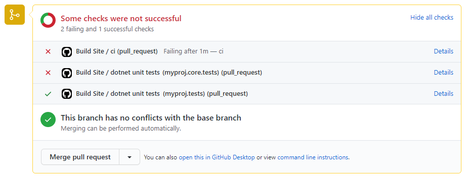

# trx-parser

This repository is based on [NasAmin/trx-parser](https://github.com/NasAmin/trx-parser).

GitHub Action that parses `dotnet test` results from `trx` files and creates a status check with the results. 
Tests are not run as part of this action.  

The outcome of this action is not affected if it encounters test failures but the status checks it creates are.  This behavior can be customized using the `ignore-failures-in-check` input.

The status check can be seen as a new item on the workflow run and there should be one check created per `trx` file.  The check is named after the test project the `trx` was generated for.

## Viewing the Status Checks
If there is a corresponding PR, the check can be viewed in the Status Checks section:
<kbd></img></kbd>

The status check can also be seen on the workflow run.  The following screenshot is an example of a check with failed tests:
<kbd></img></kbd>
*One item to note is if you have multiple workflows triggered by the same `pull_request` or `push` event GitHub creates one checksuite for that commit, the checksuite gets assigned to one of the workflows randomly and all status checks for that commit are reported to that checksuite.  That means if there are multiple workflows with the same trigger, your status checks may show on a different workflow than the workflow that created them.  See the [limitations](#github-actions-limitations) for further details.*

## Inputs
| Parameter                  | Is Required | Default                          | Description                                                                                                             |
| -------------------------- | ----------- | -------------------------------- | ----------------------------------------------------------------------------------------------------------------------- |
| `gh-token`                 | true        | N/A                              | Used for the GitHub Checks API.  Value is generally: secrets.GITHUB_TOKEN.                                              |
| `base-directory`           | false       | `.` Root Directory of repository | The base directory of where to look for `trx` files.                                                                    |
| `ignore-failures-in-check` | false       | `false`                          | When set to true the check status is set to `Neutral` when there are test failures and it will not block pull requests. |
| `timezone`                 | false       | `UTC`                            | IANA time zone name (e.g. America/Denver) to display dates in.                                                          |


## Outputs
| Output         | Description                             |
| -------------- | --------------------------------------- |
| `test-outcome` | Test outcome: *Failed,Passed*           |
| `trx-files`    | List of `trx` files that were processed |

## Examples

### Using the defaults
```yml
jobs:
  ci:
    runs-on: [ubuntu-20.04]
    steps:
      - uses: actions/checkout@v2

      - name: Test My Solution
        run: dotnet test ./src/my-solution.sln --logger "trx" --configuration Release

      - name: Parse trx reports with default
        if: always()
        uses: im-open/trx-parser@v1.0.0
        with:
          gh-token: ${{ secrets.GITHUB_TOKEN }}
```

### Specifying additional behavior
```yml
jobs:
  advanced-ci:
    runs-on: [ubuntu-20.04]
    steps:
      - uses: actions/checkout@v2

      - name: Test My Solution
        continue-on-error: true
        run: dotnet test ./src/my-solution.sln --logger "trx" --configuration Release --results-directory ../../test-results
      
      - name: Parse trx reports with default
        id: parse-trx
        uses: im-open/trx-parser@v1.0.0
        with:
          gh-token: ${{ secrets.GITHUB_TOKEN }}
          base-directory: './test-results'
          ignore-failures-in-check: 'true'
          timezone: 'america/denver'
      
      - run: ./do-other-advanced-things-in-the-build.sh

      - name: Fail if there were test problems
        if: steps.parse-trx.outputs.test-outcome == 'Failed'
        run: |
          echo "There were test failures."
          exit 1
```

## GitHub Actions Limitations
The following limitation information was taken from [NasAmin/trx-parser]
>- The GitHub Checks API has a [limit] of `65535` characters. So if the test report exceeds this limit, GitHub will fail to create a check and fail your workflow. To mitigate this size limitation, the action will only report details about failing tests. 

>- If you have multiple workflows triggered by the same event, currently GitHub Actions will randomly associate a check run to one of the workflows. [Only GitHub apps] are allowed to create a Check Suite and there is also no way to associate a custom check run with an existing check suite.  GitHub actions automatically creates a check suite for each workflow run. However, since check runs are associated with a commit and event, any custom check runs are randomly linked under one of the triggered workflows for the same commit.


## Recompiling

If changes are made to the action's code in this repository, or its dependencies, you will need to re-compile the action.

```sh
# Installs dependencies and bundles the code
npm run build

# Bundle the code (if dependencies are already installed)
npm run bundle
```

These commands utilize [esbuild](https://esbuild.github.io/getting-started/#bundling-for-node) to bundle the action and
its dependencies into a single file located in the `dist` folder.

## Code of Conduct

This project has adopted the [im-open's Code of Conduct](https://github.com/im-open/.github/blob/master/CODE_OF_CONDUCT.md).

## License

Copyright &copy; 2021, Extend Health, LLC. Code released under the [MIT license](LICENSE).

[NasAmin/trx-parser]: https://github.com/NasAmin/trx-parser#%EF%B8%8F-github-actions-limitations-%EF%B8%8F
[limit]: https://github.com/github/docs/issues/3765
[Only GitHub apps]: https://docs.github.com/en/rest/reference/checks#check-suites